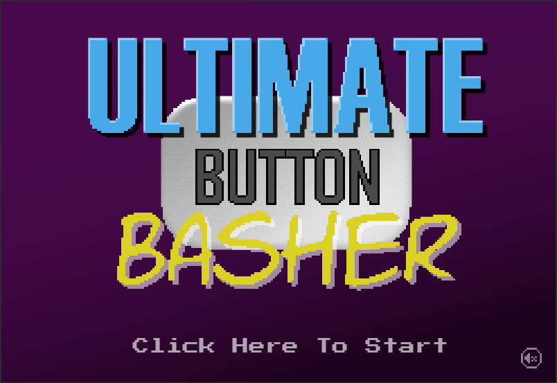
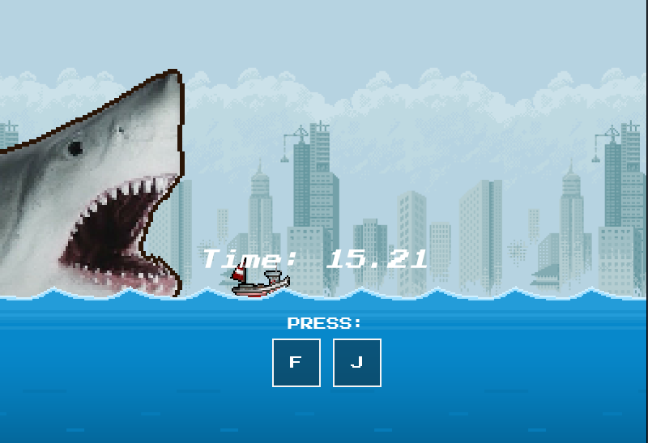

   

---

## The project

For this project I wanted to make an arcade-like retro game, inspired by Wario wares.
In the game you play mini-games.

Aside from couple images, I had to look for pictures and then turn them into pixel art myself.
I found some guidance from vanilla Javascript game tutorials, most of the game logic is made from scratch.

---

## continuation

The way it's set up, is so that I can add more games in the future.
